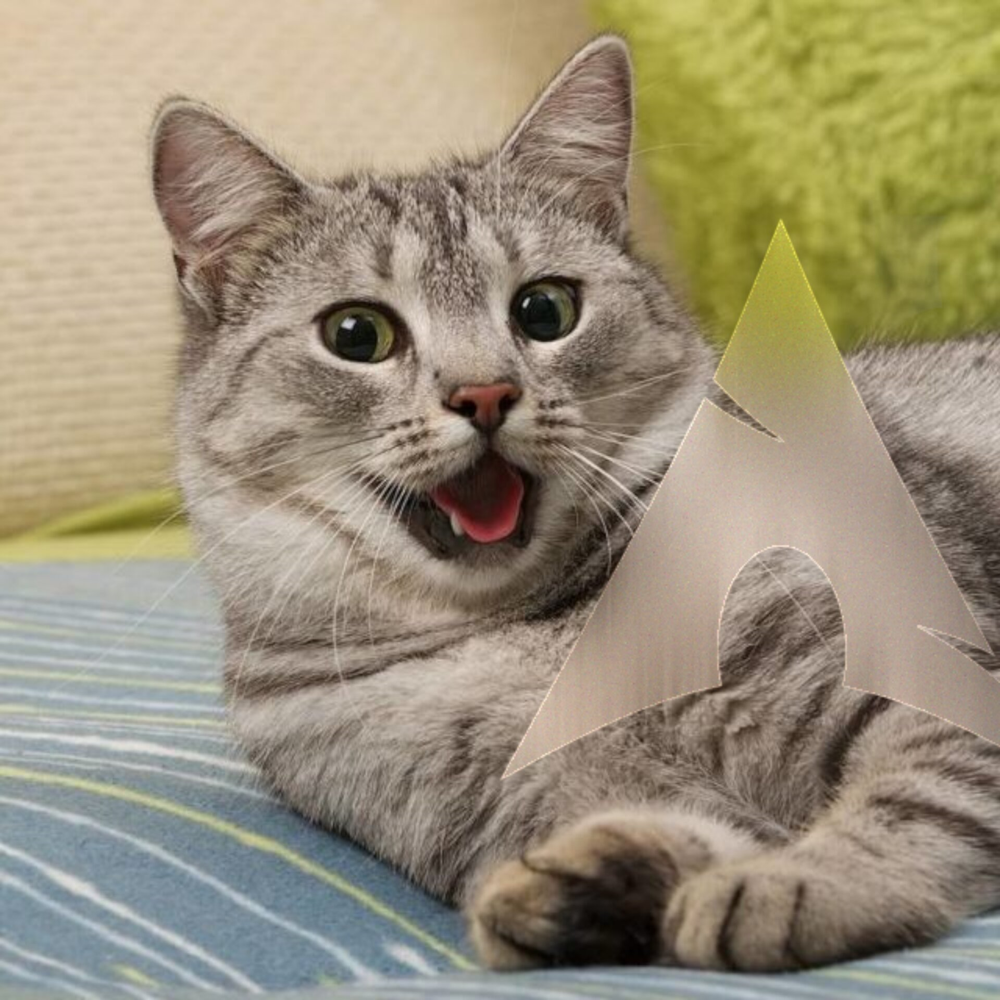

# AllRGB

Convert an input PNG image file to a an output PNG image file where every pixel
is a different color from all the others. It works with images of any aspect
ration, but care needs to be taken to not use images with more than 16777216
pixels (number of RGB colors).

The main interest of this program is to input images with 16777216 pixels (e.g.:
4096x4096 px) so we get an output with the different RGB colors. The idea came
from [allRGB.com](https://allrgb.com/).

## Compile

To compile the program, it is enough to just call:

```shell
zig build
```

in the root directory of the project (no external dependencies needed).

## Usage

The program takes the path to input image file as argument. It also accepts a
few optional arguments:

- `--no_random` - the pixels are evaluated from left to right, top to bottom,
  instead of randomly.
- `--slow` - uses a slower, alternative color selection criterion for
  conflicting colors (described below).
- `--do_check` - option useful for debugging. The program will perform a
  self-check to determine if no colors have been used more than once.
- `--noise <int>` - integer (%) that determines the amount of noise introduced
  to the image. The default value is 10%.
- `-o <out.png>` - Select name of the output file. The default is `out.png`.

## Algorithm

### Octree

The code uses an [octree](https://www.cubic.org/docs/octree.htm) to represent
the RGB color space. This mean that the octree is 8 levels deep (excluding the
root node).

### Color representation

Each node of the octree contains the number of unused colors in that node. Each
leaf of the tree represents a color. The color represented is obtained as
follows:

1. Take the ith bit from the R, G, and B components of a color.
2. With these 3 bits, we can obtain a 3-bit integer ([0, 7]), RiGiBi.
3. This integer is used to select the next child to explore in the tree.
4. We repeat this process 8 times: 8-bit RGB components; each iteration takes 1
   bit from each.

e.g.:

```txt
RGB = #45152A

   7 6 5 4 3 2 1 9
R: 0 1 0 0 0 1 0 1
G: 0 0 0 1 0 1 0 1
B: 0 0 1 0 1 0 1 0

i: 0 4 1 2 1 6 1 6
```

### Color selection

We decrement the count of unused children colors for each node we pass. When we
attempt to choose a child-node that has no more colors available, we need to
choose a different neighbor. This choice can depend on the chosen criterion:

- 0 (default) - we use a lookup table:

```txt
[
  [ 1, 4, 5, 2, 3, 6, 7 ],
  [ 0, 5, 4, 3, 2, 7, 6 ],
  [ 3, 6, 7, 0, 1, 4, 5 ],
  [ 2, 7, 6, 1, 0, 5, 4 ],
  [ 5, 0, 1, 6, 7, 2, 3 ],
  [ 4, 1, 0, 7, 6, 3, 2 ],
  [ 7, 2, 3, 4, 5, 0, 1 ],
  [ 6, 3, 2, 5, 4, 1, 0 ],
]
```

This criterion is the fastest and usually generates images that resemble a sepia
tone.

- 1 (`--slow`) - we use a
  [weighted mean](https://www.compuphase.com/cmetric.htm) to find which neighbor
  potentially allows the most similar color (based on distances). This criterion
  is noticeably slower than the previous one, but is faster than converting the
  colors to another color space (e.g.: CIELAB) and allows us keep working in RGB
  only (stay in theme). Images produced are 'more vibrant' when using this
  criterion.

## Examples

- Image



- Image produced using the program's default options


- Image produced using the `--slow` option


- Image produced without introducing noise to the image


## LodePNG

[LodePNG](https://github.com/lvandeve/lodepng) is used to both **read** and
**write** PNG image files.

## Bibliography

- [Octree to represent RGB space](https://www.cubic.org/docs/octree.htm)
- [Color quantization using an octree](http://www.leptonica.org/papers/colorquant.pdf)
- [Color quantization for dithering](https://tpgit.github.io/UnOfficialLeptDocs/leptonica/color-quantization.html)
- [Source for the lookup table](https://github.com/fogleman/gorgb)
- [Source for the formula for the RGB color distance](https://www.compuphase.com/cmetric.htm)

## License

Unless stated otherwise, all the source code files included in this repository
are licensed under an [MIT license](./LICENSE) present in
[this file](./LICENSE).
